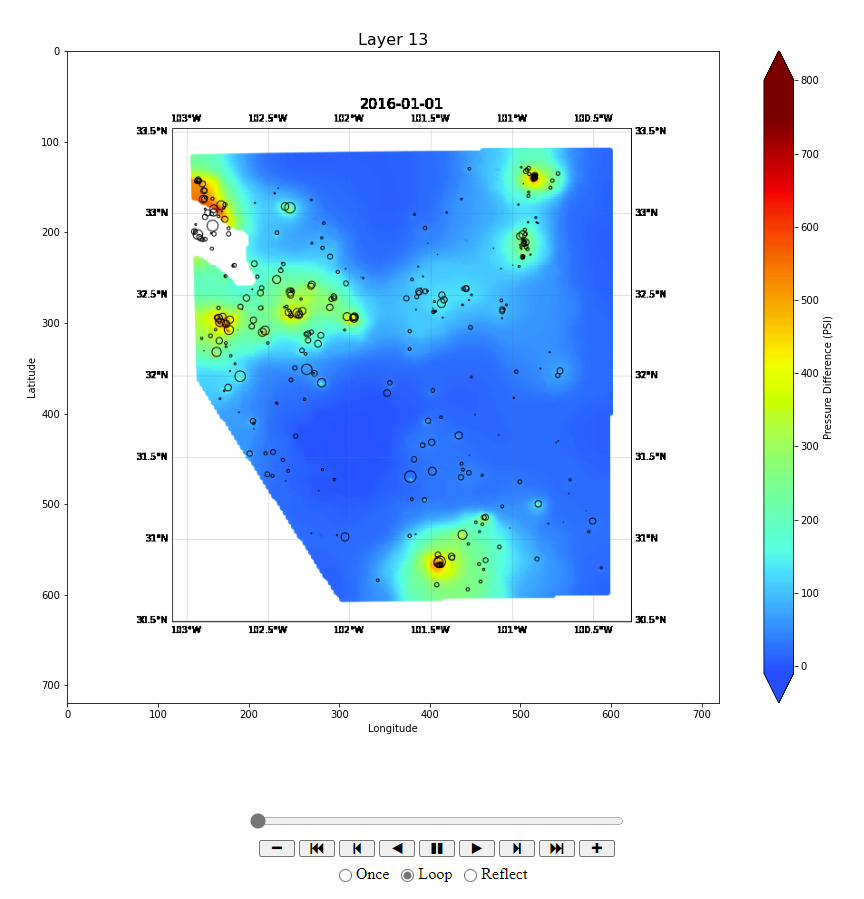
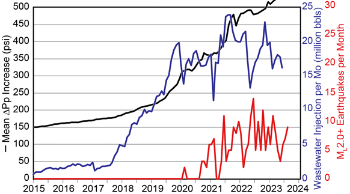

# Interactive Geomap Analysis of Seismic Activity and Salt Water Disposal Well Injection Rates in the Delaware Basin

## 
Executive Summary

This proposal outlines a detailed plan to investigate the relationship between induced seismic activity and salt water disposal (SWD) well injection rates in the Delaware Basin. Utilizing data from the public catalog TexNet and incorporating pore pressure data from a sophisticated gridded numerical model developed using Computer Modelling Group (CMG) software, our goal is to uncover potential correlations and deepen our understanding of the seismic risks associated with SWD well injection practices.

## 
Objectives
 
- To analyze and visualize seismic activity patterns alongside SWD well injection rates.
- To integrate TexNet earthquake data (public domain catalog), SWD well injection rate data (public domain data), and pore pressure data (output of the model) from a CMG-built gridded model for comprehensive analysis.

## 
Database Development

We will develop a database system pivotal for analyzing the relationship between seismic activity, SWD well injection rates, and pore pressure in the Delaware Basin. This integrated database will enable us to derive insights for safer and more sustainable SWD well injection practices.

### 
1. Scope

- **Earthquake Data**: Sourced from the TexNet public catalog via API ([TexNet Catalog](https://maps.texnet.beg.utexas.edu/arcgis/rest/services/catalog/catalog_all_flat/MapServer)).
- **SWD Well Injection Rate Data**: Via relevant APIs ([Injection Data](https://injection.texnet.beg.utexas.edu/apidocs)).
- **Pore Pressure Data**: Extracted from CMG model outputs, provided as TXT files.

### 
2. Database Design

- **Tables**: The database will include three primary tables: `earthquakes`, `well_injection_rates`, and `pore_pressure`, each designed to store specific datasets with appropriate primary keys and data types.
- **Relationships**: Identifying relationships between tables to facilitate comprehensive data analysis.
- **Data Types**: Careful consideration of data types for each column to ensure data integrity and query efficiency.

### 
3. Implementation Steps

- **Database and Table Creation**: Utilizing PostgreSQL, the database and tables will be created according to the defined schema, ensuring robustness for storing and querying large datasets.
- **Data Extraction and Transformation**: Utilize Python scripts for API calls to fetch earthquake and SWD well injection rate data. Process the CMG model's TXT file output to extract pore pressure data, preparing it for database insertion.
- **Data Loading**: Employ `psycopg2` or a similar library for data insertion into PostgreSQL. Automate the data insertion process for ongoing data collection and updates.
- **Verification and Iteration**: Conduct data integrity checks and performance optimization. Refine the database schema as needed based on initial findings and data analysis requirements.

### 
4. Technologies

- **Database**: PostgreSQL for its advanced features and support for complex queries.
- **Programming Languages**: Python/JavaScript for data extraction, transformation, and loading processes.
- **Libraries**: `requests` for API interactions, `pandas` for data processing, and `psycopg2` for database interactions.

## 
Integrated Data Visualization Development

We propose to create a cutting-edge visualization tool designed to investigate the causal mechanisms of seismicity attributable to produced water injection into Underground Injection Control (UIC) wells and the associated changes in pore pressure. This tool will integrate sophisticated mapping and data analysis features, providing users with a comprehensive platform for exploring and understanding the seismic impact of SWD practices.

### 
1. Layered Geomaps and Time-Series Plots

The visualization toolkit will consist of the following interconnected components:
- **Layered Geomaps**: An interactive geomap will serve as the base layer, upon which data from the TexNet earthquake catalog, SWD well injection rates, and CMG gridded model data on pore pressure will be overlaid. These layers will be animated to display changes over time, providing an intuitive visual understanding of the evolving relationships.

&nbsp;&nbsp;&nbsp;&nbsp;&nbsp;&nbsp;&nbsp;&nbsp;&nbsp; 

- **Time-Series Plots (Conditional)**: Subject to the scope and timeframe of the project, the tool aims to include time-series plots that allow users to examine trends and correlations. These plots will feature mean pore pressure increase over time, wastewater injection rates, and earthquake frequency, offering detailed insights if project timelines permit.

&nbsp;&nbsp;&nbsp;&nbsp;&nbsp;&nbsp;&nbsp;&nbsp;&nbsp; 

### 
2. Web Interface and Navigation

To effectively organize and display the diverse array of visualizations developed across different projects, the tool will feature a web interface housing several tabs, each dedicated to specific sets of visualizations.

- **Tabbed Interface for Visualization Projects**:  
The web interface will incorporate a tabbed structure to facilitate easy navigation between different visualization sets:

      Project 1 Visualizations Tab: This tab will showcase visualizations from the first project, including Piper plots, interactive geomaps (if time allows), and box and violin plots for each basin. Users will have the flexibility to select basins of interest from a dropdown menu, allowing for customized data exploration.

      Project 3 Visualizations Tab: A separate tab will display the visualizations developed in project 3, detailing the advanced analyses and insights derived from this phase of the work.
      
      Future Expansion: The design anticipates the addition of more tabs to accommodate visualizations from the final project and any subsequent analyses. This approach ensures that the tool remains scalable and adaptable, providing a comprehensive resource for users.

### 
3. Technologies and Tools

- **Data Sources**:Integration of TexNet earthquake data, SWD well injection rate data, and CMG gridded model data.
- **Programming Languages**: Utilization of Python for backend data analysis and visualization scripting, coupled with JavaScript for frontend interactive visualization features.
- **Web Development Technologies**: : Employment of HTML and CSS to structure and style the web interface, ensuring accessibility and ease of use.

## 
Conclusion

This project is committed to providing a thorough understanding of the interplay between seismic activity and SWD well injection practices in the Delaware Basin. By integrating diverse data sources and developing an interactive visualization tool, we aim to deliver actionable insights and recommendations, contributing to safer and more sustainable injection practices in the region.
 
 
 

<!-- # **PART 2** &nbsp; | &nbsp; Visualization of Produced Water Chemistry for Environmental and Agricultural Utilization

## 
Summary
 
An interactive dashboard will be built to enhance the user's ability to view the data for produced water chemistry by basin. This will allow users to explore the data through a platform that is accessible without needing the ability to run the code themselves and without needing access to a the folders within which the visuals are housed.

## 
Objectives
 
- To utilize and build upon the visuals generated in Project 1.
- The code for the following visuals will be revised and expanded to incorporate them into an interactive dashboard. The user will select which basin they want to view data for via a dropdown menu.
    - Box Plots
    - Violin Plots
    - Piper Plots
- If time allows, incorporating the previous geomaps will be explored.

## 
Method
 
- The modifications will be accomplished through a combination of JavaScript, html, css, and tweaking the original python where needed. -->